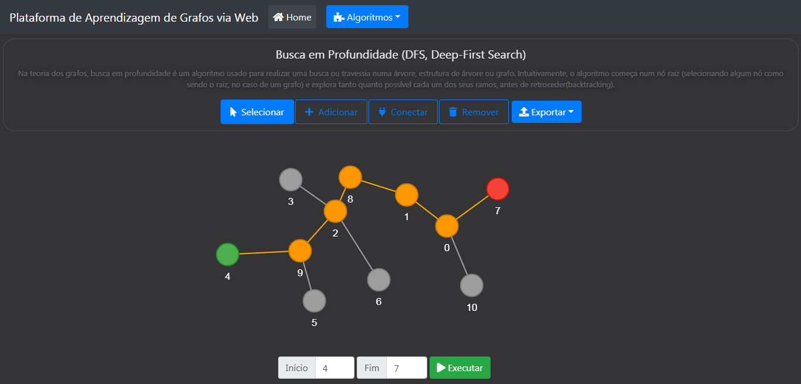
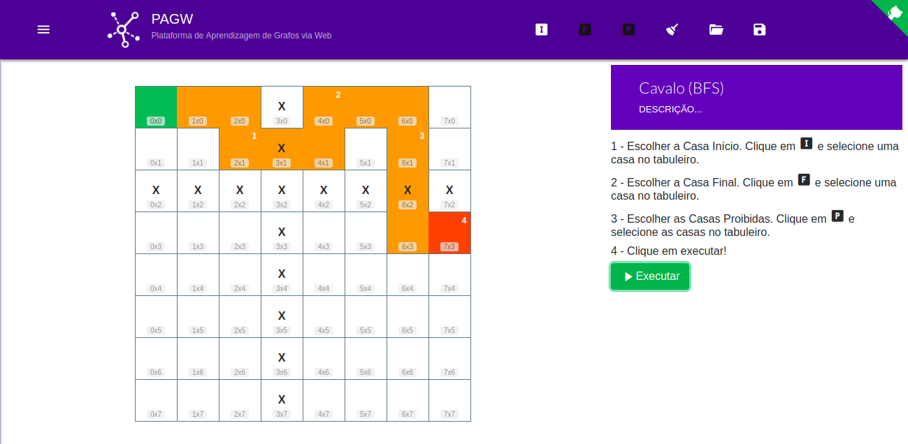

# PAGW

>  Plataforma de Aprendizagem de Grafos via Web

### Objetivo

Projeto realizado no site pré-existente Algoritmos e Aplicações em Grafos, por meio do Programa Institucional Voluntário de Iniciação Científica (PIVIC). Nesse projeto foram detectadas algumas funcionalidades que poderiam ser melhoradas e outras a serem implementadas; além disso, o site desenvolvido em PHP na versão 7.0 foi hospedado em servidor que utiliza PHP 5.3. Durante o projeto, o site se tornou funcional em PHP 5.3 e pode ser acessado de forma adequada na hospedagem oferecida. 

O trabalho também se propôs a buscar soluções para melhorar a geração de imagens de matrizes e listas de adjacência. A partir do ajuste na geração de imagens, foram implementadas funções para geração de PDF. Aperfeiçoamentos visuais foram realizados na plataforma para uma melhor usabilidade.

### A Plataforma





### Recursos

* Crie seus grafos com rapidez e praticidade;
* Salve seus grafos em JSON para poder reusá-los;
* Exporte seus grafos como matriz de adjacência ou lista de adjacência;
* Exporte seus grafos como imagem PNG ou JPG;
* Escolha se seu grafo será um grafo direcionado ou não;
* Execute os algoritmos e veja seu passo-a-passo.

### Execução em Linux via Docker

#### Pré-requisitos
* Docker
* Docker-Compose
* Ctop

#### Configuração

* Na primeira execução do projeto, deverá ser criado o container da aplicação a partir do comando:
```bash 
$ sudo docker-compose up --build
```
#### Executar o projeto

Há duas formas de executar o container da aplicação do projeto, uma delas é utilizando o Docker-Compose e a outra é utilizando o Ctop.

* Para subir o container da aplicação e executar o projeto, execute o comando:

```bash
$ sudo docker-compose up
```
* Para monitorar o container, execute o comando:

```bash 
$ sudo ctop
```
