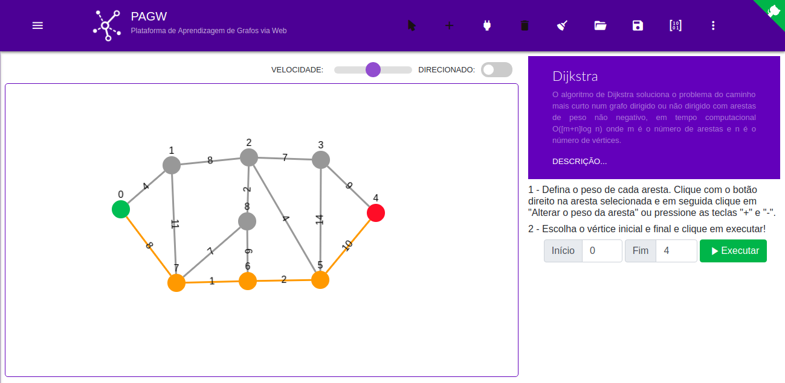

# PAGW

>  Plataforma de Aprendizagem de Grafos via Web





### Features

* Crie seus grafos com rapidez e praticidade;
* Salve seus grafos em JSON para poder reusá-los;
* Exporte seus grafos como matriz de adjacência ou lista de adjacência;
* Exporte seus grafos como imagem PNG ou JPG;
* Escolha se seu grafo será um grafo direcionado ou não;
* Execute os algoritmos e veja seu passo-a-passo;

### Pré-requisitos

* Docker
* Docker-Compose
* Ctop

### Primeiros passos

* Para criar o container da aplicação, execute o comando:

```bash 
$ sudo docker-compose up --build
```
* Para subir o container da aplicação e executar o projeto, execute o comando:

```bash
$ sudo docker-compose up
```
* Para monitorar o container em execução, execute o comando:

```bash 
$ sudo ctop
```
